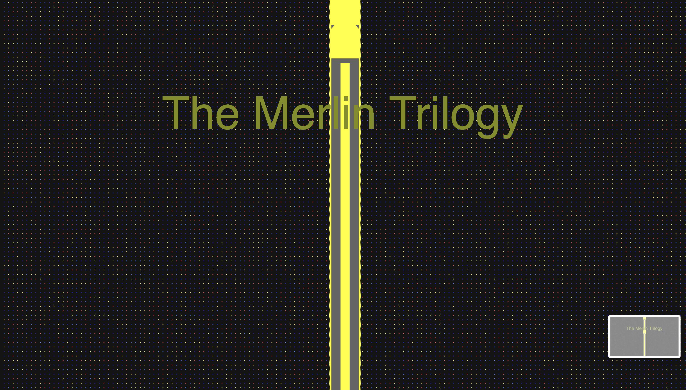
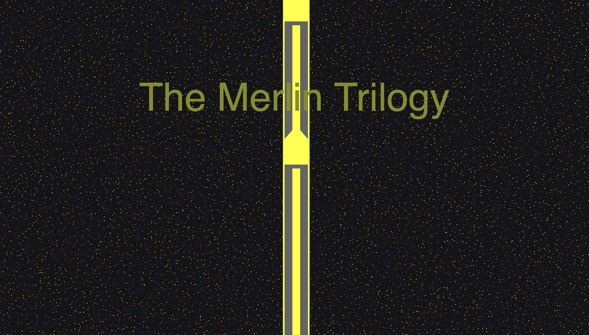
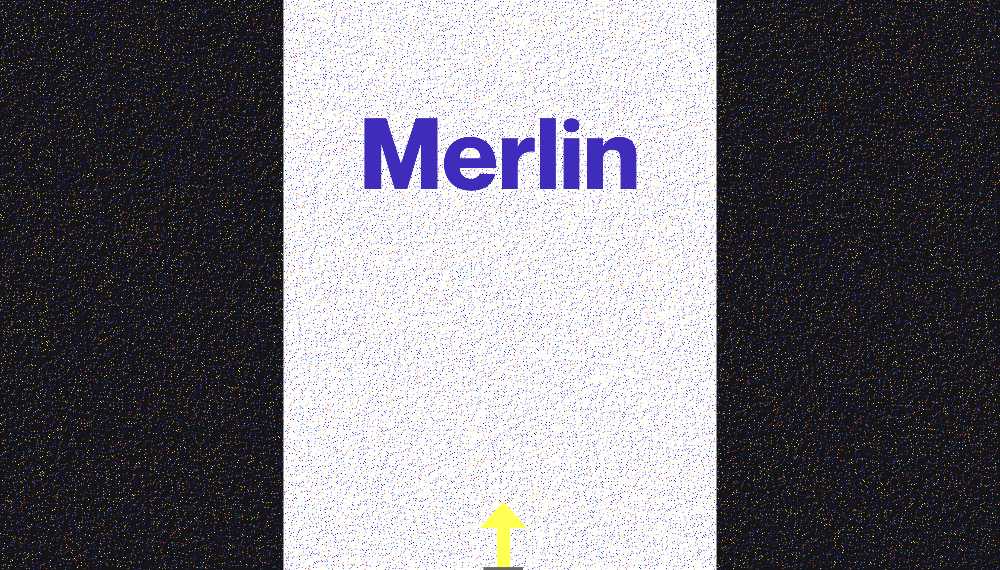
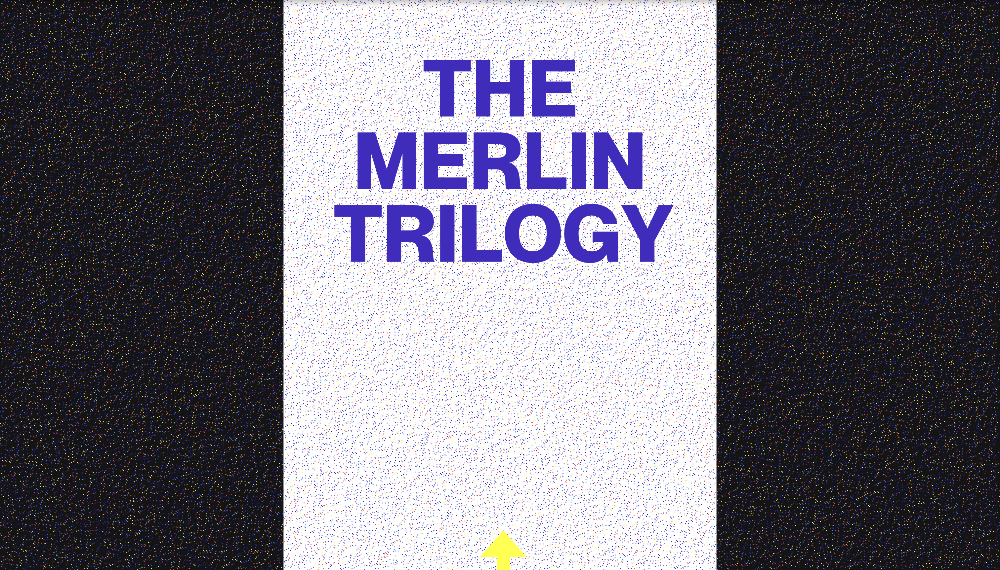
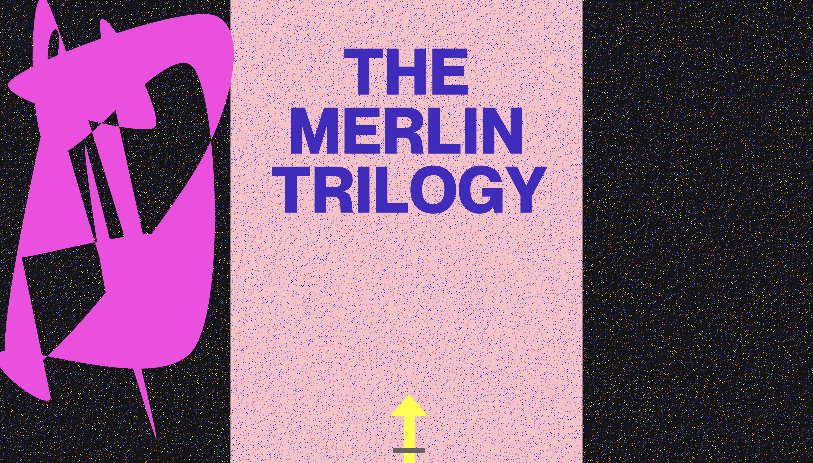
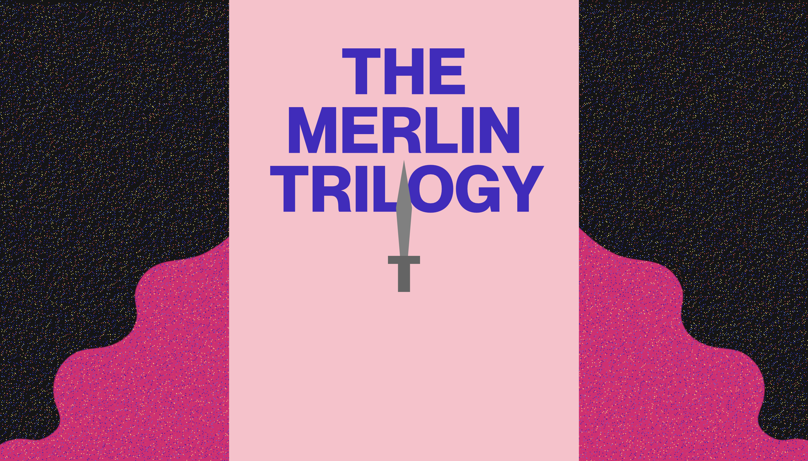
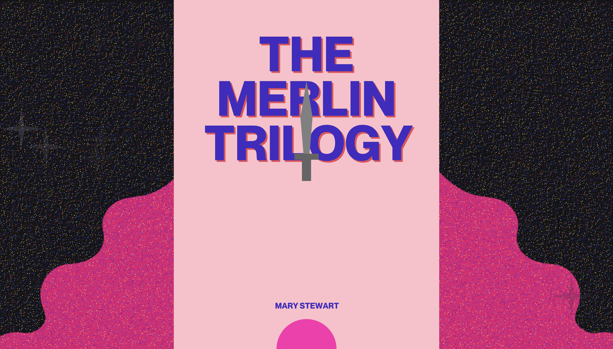
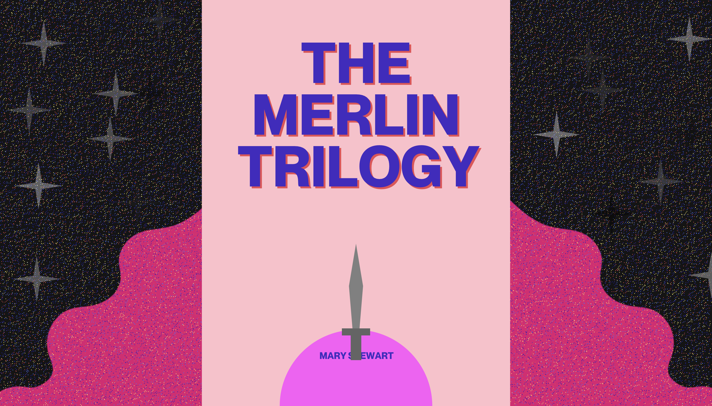

# Guide
Book: The Merlin Trilogy  
Intro: An authorian legend but from the perspective of Wizard Merlin  
Ways of Interactivity: Time-based animation + Click to generate stars in the sky!  

# Book Choice
I chose The Merlin Trilogy as my book. This is a book about a series of three historical fantasy novels that reimagines the Arthurian legend through the perspective of the legendary wizard Merlin. 

# Week 3 Final Update
This week, I did a lot by rethinking what a book cover should be.   
First, I ditched the original way of drawing dots using only random(). I chose to try for() to create dots in a more controllable way.I created the background like this:
  

I added random() to add onto the variables to make the grid shifts.  
  

I observed that the dots are too uniformly distributed and it's not like an actual sky, so I tried to control the density of dots by adjusting the spacing in between and the size of circles. I noticed that when the spacing is too small, the framerate can't be displayed as fast as a simpler one.   
  

Then, I moved on to the front scene. I planned to use the actual ratio of book to draw the new book cover, so I got the number 6.4" x 9.6". Because the book size is bigger than my screen, I decided to use ratio. I used the way how we put the rectangle in the middle of image by using the width/2 - length/2. 
  
  

After having an actual cover, I began considering resketching the whole cover. I went to my Ipad to draw this:
  

To draw the pink area, I struggled to find tutorials or references for drawing solid curves with specific vertex locations and angle at the same time. This is a paragraph I tried:  
  

 So I thought about directly using images like we just learned in class. I drew this on my ipad using a high dpi and approximate height reserved for it:
 
 

I managed to adjust the size and position of the images.   
 

In the meantime, I wrote a lot of function() to draw different parts. It was a realization how I didn't need to do all the stuffs in draw().  

Then, I moved on to compose Author's Excalibri rising up from the stone. I first corrected the form of sword to a more pleasant way by using beginshape(). Then I revised the original moveSword() to make the sword move using if else. 
 

I wanted to compose a light when the sword comes out (stones turn out to be too tedious). So I wrote a drawOrna() function using if/else to make a loop for the ellipse. I added the author's name, Mary Stewart. 
 

Finally, I wanted to add some big stars to the cover. I wanted it to be interactive, so I created a star class and refered to stars on Processing (I couldn't do it) to create a four-corner star. In the class, I wrote the update of alpha channel and outside a mouseClicked(). 

  

# Week 2 update
This week I tried to make the sword animation. Somehow it has this feature of lifting to the sky. It is pretty cool, but I'll refine it in the future. Also, I used RGB dots to try to create this sky of stars. For now, I have functions of drawing stars and the sword. For the following week, I would:

1. Use smaller dots to create a high-detailed sky (for loop) - can I use for loop to cover every (1,1) pixels?
2. Create a pixel-style stone to cover up the sword
3. Use color change based on second to do time-based starry sky
4. Create a giant "+" Star in the bg using for loop
5. Use class() to define some decorative elements
6. Create a title using text()

## Book Cover
1. I'll include Merlin the wizard in book cover. 
2. Stars (gifs)
3. a beautifu sky
4. Maybe Excalibur the sword
5. It would be interactive, given it's a magic book

## Possible Ideas
I want to explore the visual effects that could be similar to using magic, like mouseClick() and maybe an interactive sword in the stone that can be pulled out.  

I think my idea can be related to the reading that talks about interactive design. I will try to create a visual conversation.

## Sketch
  

